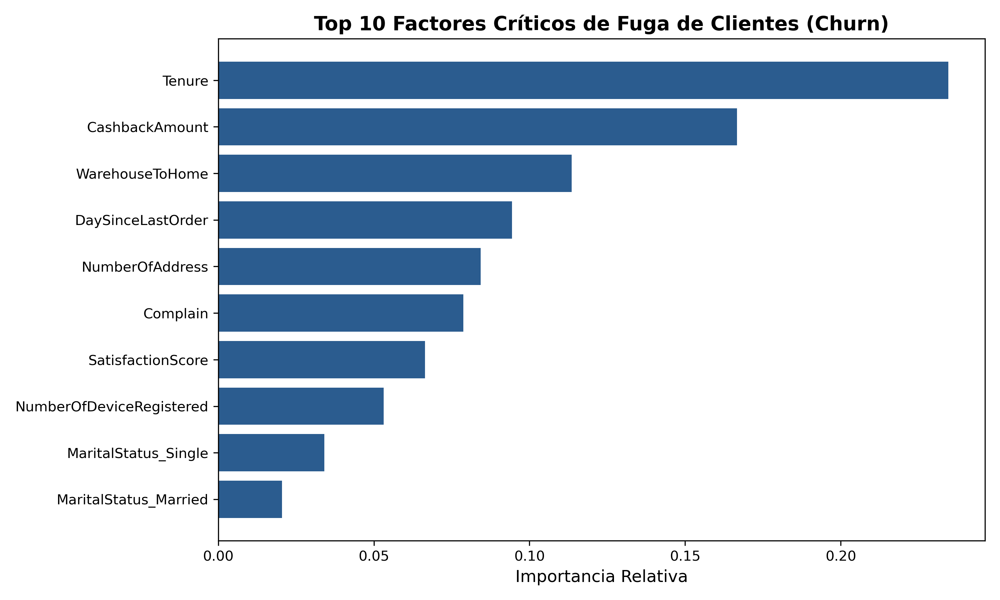

# 🛒 E-Commerce Customer Churn Prediction

## 📌 Resumen Ejecutivo
La retención de clientes es uno de los pilares de rentabilidad en cualquier e-commerce. Adquirir un nuevo cliente es significativamente más costoso que retener a uno existente. Este proyecto desarrolla un modelo de Machine Learning capaz de identificar proactivamente qué clientes tienen una alta probabilidad de abandonar la plataforma (Churn), permitiendo al equipo comercial activar estrategias de retención focalizadas.

# 1) Impacto del Negocio
* **Precisión Global (Accuracy):** `93.66%` de acierto en las predicciones generales.
* **Tasa de Captura (Recall):** El modelo logra identificar al **74%** de los clientes que efectivamente iban a fugar. 
* **Accionabilidad:** Con esta alerta temprana, el equipo de marketing puede optimizar su presupuesto, dirigiendo descuentos o llamadas de fidelización exclusivamente a este segmento en riesgo, maximizando el ROI de las campañas.

## 2) Stack Tecnológico
* **Lenguaje:** Python
* **Manipulación de Datos:** Pandas, NumPy
* **Machine Learning:** Scikit-Learn (Random Forest Classifier)
* **Entorno:** Jupyter Notebooks / VS Code

## 3) Metodología (Pipeline de Datos)
1. **Extracción y Exploración (EDA):** Análisis de un dataset de ~4,000 transacciones y perfiles de usuarios de e-commerce.
2. **Data Cleaning & Imputación:** Tratamiento de valores nulos en variables clave (como `Tenure` y `DaySinceLastOrder`) utilizando imputación por la media para preservar el volumen de datos.
3. **Feature Engineering:** Transformación de variables categóricas a numéricas mediante *One-Hot Encoding*.
4. **Modelado:** Entrenamiento de un algoritmo `RandomForestClassifier` (100 estimadores) separando los datos en 80% entrenamiento y 20% prueba.

## 4) Insights de Negocio (Feature Importance)
Tras analizar el modelo Random Forest, pudimos extraer los factores clave que determinan la fuga de clientes. Esto permite pasar de una predicción ciega a una estrategia comercial accionable:
1. **Antigüedad (`Tenure` - 1st Driver):** El tiempo que el usuario lleva en la plataforma es el predictor más fuerte. Los nuevos usuarios son los que presentan mayor riesgo de abandono; si no se les engancha a tiempo, se van.
2. **Incentivos Económicos (`CashbackAmount`):** La estructura de devoluciones y beneficios económicos juega un papel crucial en la decisión de permanencia.
3. **Logística (`WarehouseToHome`):** La distancia y eficiencia de entrega influyen directamente en la satisfacción y retención a largo plazo.



## 5) Cómo ejecutar este proyecto localmente
1. Clona este repositorio:
   ```bash
   git clone [https://github.com/Jarri24/ecommerce_churn.git](https://github.com/TU-USUARIO/ecommerce_churn.git)
